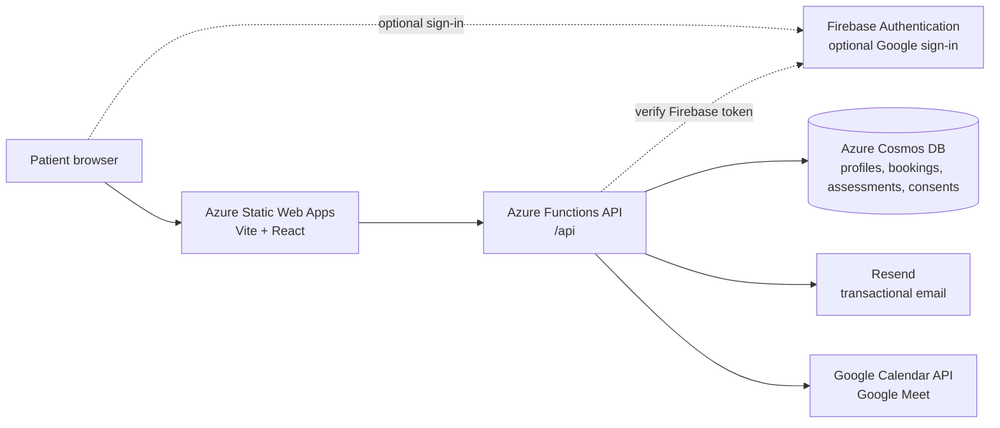
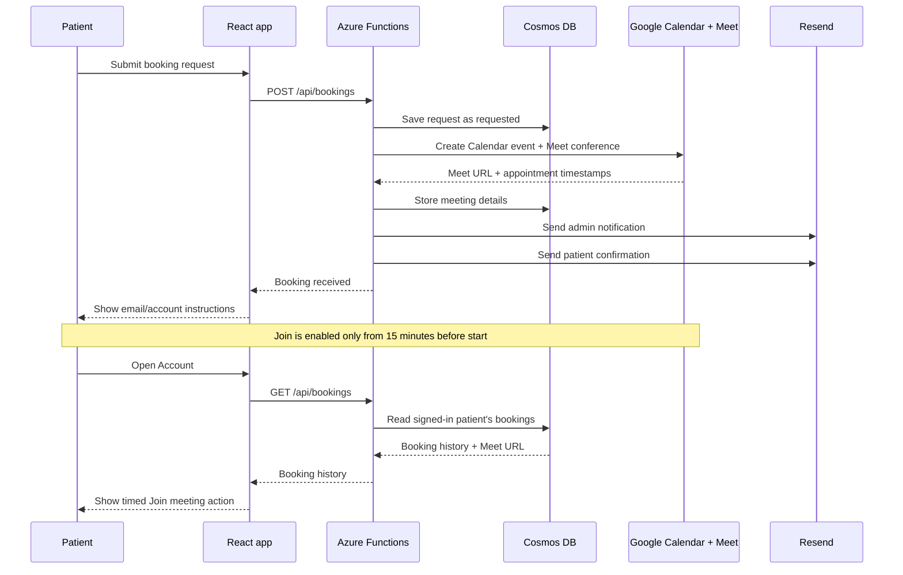
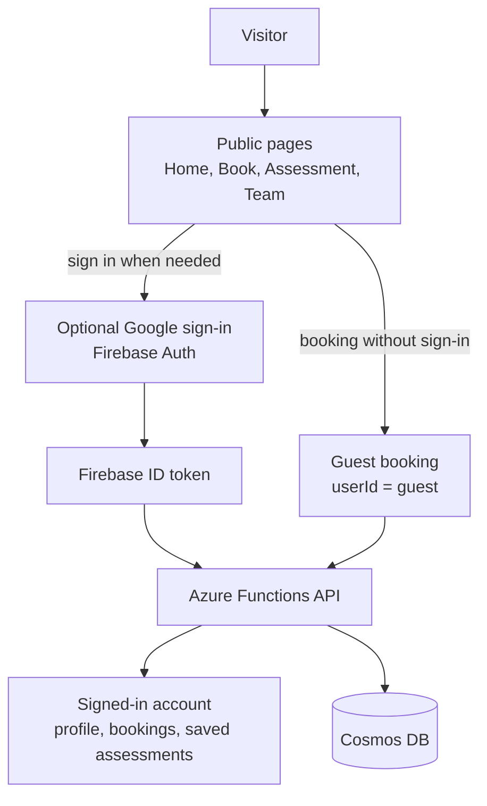
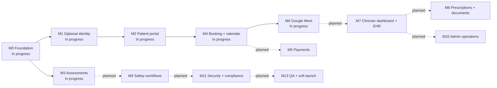
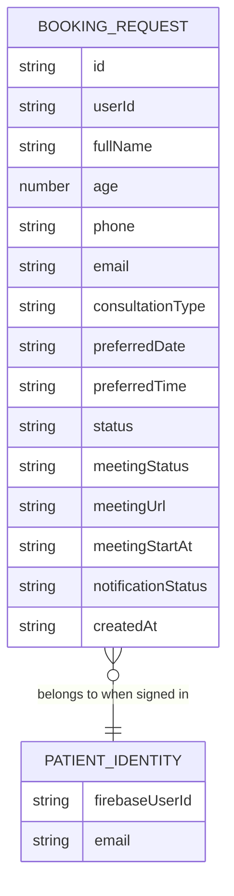

# Antaran Platform Diagrams

These diagrams describe the current MVP implementation. Dashed nodes are planned or deferred and are not part of the live booking path.

## Current System Architecture

## Booking and Meeting Flow

## Authentication and Data Access

## Current MVP to Planned Roadmap

## Current Booking Data Shape

Guest records use `userId = guest`; they are saved successfully but are not automatically claimed by a later account login.
