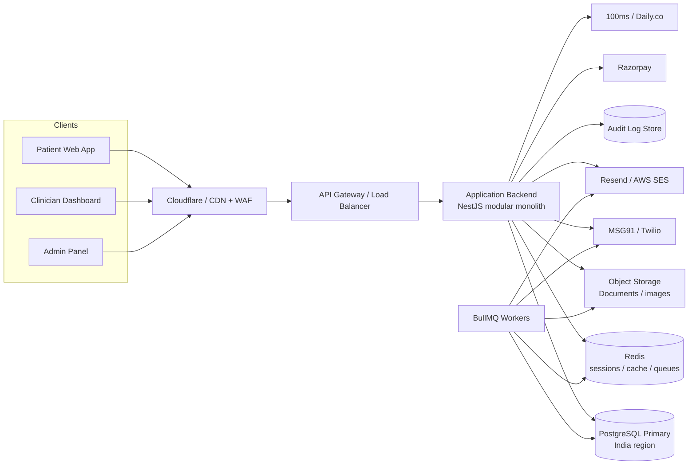
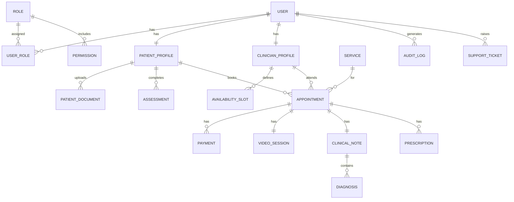
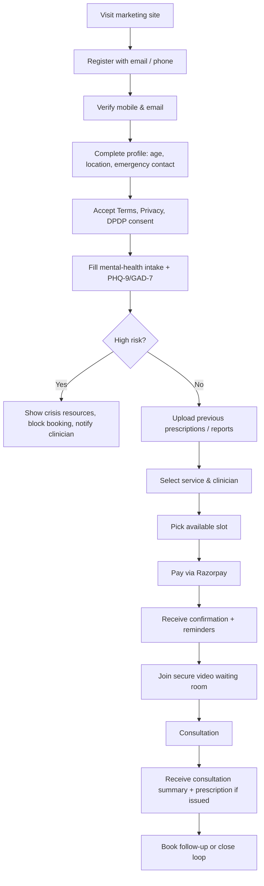
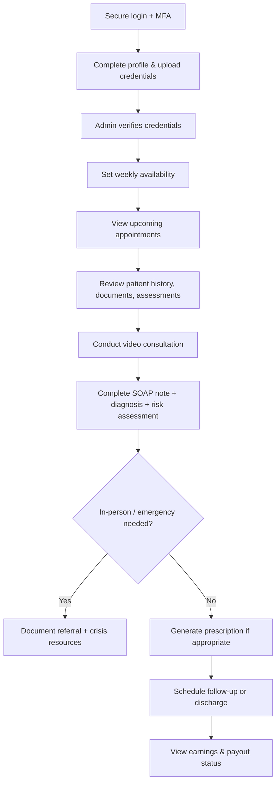
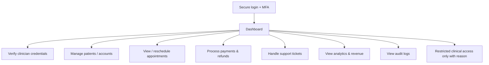
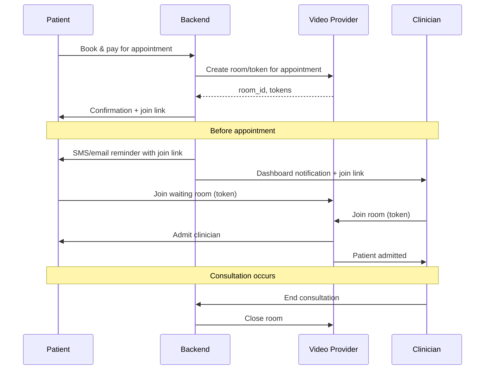
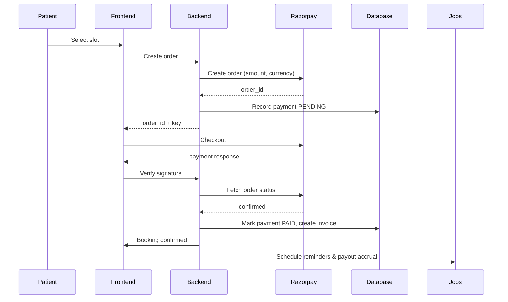

# Antaran Platform — Architecture Plan

> First-iteration architecture plan for a Pan-India telepsychiatry / mental-health platform.
>
> This document answers the 16 prep items requested before development begins. It is a **proposal**, not a final specification. Decisions marked with open questions must be resolved in `QUESTIONS_AND_DECISIONS.md` before coding.

---

## 1. Technical architecture

### High-level diagram

### Architectural choices

- **Modular monolith first.** The backend is organized into bounded modules (identity, appointments, clinical records, payments, video, communications, admin, audit). This keeps deployment simple for the MVP while making it straightforward to extract services later if scale demands it.
- **API-first.** All clients talk to the same REST/JSON API. Future mobile apps can reuse it.
- **India-region data.** Primary database, backups, and object storage are hosted in Indian cloud regions for DPDP readiness and low latency.
- **Event-driven background jobs.** Reminders, invoices, payouts, retention deletion, and audit exports run as idempotent workers.
- **Separate clinician and admin dashboards.** They can live in the same Next.js application with role-based routing or as separate deployables. This decision is pending (Q-TECH-01).

---

## 2. Recommended tech stack

| Layer | Proposed choice | Rationale / Alternatives |
|-------|-----------------|--------------------------|
| **Frontend (all roles)** | Next.js 14 (App Router), TypeScript, Tailwind CSS, React Query, React Hook Form + Zod | SSR for marketing, role-based routing, API routes for webhooks. Alternative: keep Vite React for the landing page and build dashboards separately (Q-TECH-01). |
| **Backend** | NestJS (Node.js) + TypeScript | Modular, validation, OpenAPI, easy migration path to microservices. Alternative: Next.js API routes for very small MVP, but less scalable. |
| **Database** | PostgreSQL 16 + Prisma ORM | ACID, mature, excellent TypeScript tooling, migration support. |
| **Cache / sessions / queue** | Redis (managed) | Sessions, rate-limit counters, BullMQ job queues, cache. |
| **Auth** | Self-built secure JWT + refresh tokens, or Clerk/Auth0 | MFA required for clinicians/admins. Decision pending (Q-TECH-02). |
| **File storage** | Cloudflare R2 or AWS S3 Mumbai | Encrypted at rest, India region, S3-compatible. |
| **Video** | 100ms or Daily.co | Token auth, waiting rooms, India POPs, recording opt-in. Decision pending (Q-TECH-03). |
| **Payments** | Razorpay | Best Indian coverage (UPI, cards, net banking), webhooks, refunds, payouts. |
| **SMS** | MSG91 or Twilio | MSG91 is cost-effective for Indian OTP. |
| **Email** | Resend or AWS SES | Transactional notifications, invoices, reminders. |
| **Monitoring** | Sentry + Logtail/CloudWatch + UptimeRobot | Error tracking, structured logs, uptime alerts. |
| **Hosting** | Vercel (frontend), Railway/Render/Fly/AWS (backend), managed Postgres/Redis | Vercel for Next.js; backend can move to AWS/GCP later. |
| **DevOps** | GitHub Actions, Docker, Terraform/Pulumi (later) | CI/CD, infrastructure-as-code as the team grows. |

---

## 3. Database structure

### Entity-relationship diagram

### Key tables

| Table | Purpose | Critical fields |
|-------|---------|-----------------|
| `users` | Authentication identity | id, email, phone, password_hash, role, email_verified, phone_verified, mfa_enabled, status, created_at |
| `roles` / `permissions` / `user_roles` | RBAC | role_id, permission_key |
| `patient_profiles` | Patient demographics & emergency info | user_id, full_name, dob, gender, address, city, state, pincode, emergency_name, emergency_phone, consent_flags |
| `clinician_profiles` | Credentials & payout details | user_id, full_name, registration_number, council, qualifications, specializations, verification_status, commission_rate, bank_details_json |
| `services` | Consultation types | name, duration_min, price_inr, category, is_active |
| `availability_slots` | Clinician schedule | clinician_id, date, start_time, end_time, is_booked |
| `appointments` | Booking record | patient_id, clinician_id, service_id, scheduled_at, mode, status, payment_id, risk_flag, timezone |
| `clinical_notes` | SOAP notes | appointment_id, clinician_id, subjective, objective, assessment, plan, risk_assessment_json |
| `diagnoses` | Diagnosis codes | note_id, code, code_type (ICD-10), description |
| `prescriptions` | Generated prescription | appointment_id, clinician_id, medications_json, instructions, generated_at, signed_at |
| `assessments` | Validated scale responses | patient_id, type (PHQ-9/GAD-7), responses_json, score, risk_flag, completed_at |
| `patient_documents` | Uploaded reports | patient_id, type, storage_key, filename, mime_type, uploaded_at, encryption_key_id |
| `payments` | Payment transactions | appointment_id, gateway, gateway_order_id, amount_inr, status, invoice_id, metadata |
| `invoices` | Tax invoices | payment_id, invoice_number, gstin, amount, tax, pdf_url |
| `payouts` | Clinician payouts | clinician_id, amount, commission, status, period_start, period_end |
| `video_sessions` | Video room metadata | appointment_id, provider, room_id, provider_token, started_at, ended_at, recording_consent |
| `audit_logs` | Security/compliance log | user_id, action, resource_type, resource_id, ip, user_agent, timestamp |
| `support_tickets` | Customer support | user_id, category, status, assigned_to, created_at, resolved_at |

### Indexing & partitioning notes

- Index `appointments` by `(clinician_id, scheduled_at)`, `(patient_id, scheduled_at)`, and `status`.
- Index `audit_logs` by `timestamp` for retention exports; consider time-based partitioning as volume grows.
- Encrypt `bank_details_json` and other PII at the application level if not natively encrypted by the database.

---

## 4. User roles and permissions

| Role | Description | Key permissions |
|------|-------------|-----------------|
| `PATIENT` | Registered adult patient | View/edit own profile, book/cancel own appointments, view own history, upload own documents, join video calls, pay, raise support tickets. |
| `CLINICIAN` | Verified psychiatrist/psychologist | Manage own profile/credentials, set availability, view assigned patients, read clinical records of assigned patients, write notes/diagnoses/prescriptions, view own earnings. |
| `ADMIN` | Platform operations | Verify clinicians, manage users (non-clinical), manage appointments/payments/refunds, view support tickets and analytics, view audit logs, restricted clinical access only when explicitly authorized. |
| `SUPER_ADMIN` | Founder / platform owner | All admin permissions plus configuration, commission/payout rules, role management, security settings, data-export/deletion. |
| `SUPPORT_AGENT` *(Phase 2)* | Helpdesk | View non-clinical user/account info, respond to tickets, initiate refunds per policy. |

### Permission examples

- `appointment:book:self`
- `clinical_record:read:assigned`
- `clinical_record:write:assigned`
- `prescription:create:assigned`
- `admin:user:read`
- `admin:payment:refund`
- `admin:audit:read`
- `system:config:write` (super-admin only)

---

## 5. Patient workflow

### Notes

- Age gate rejects users under 18.
- High-risk flag (`risk_flag`) can be set by intake, assessment, or clinician during any interaction.
- Reminders are sent at booking confirmation, 24h before, 1h before, and 15min before.

---

## 6. Clinician workflow

### Notes

- Clinicians cannot see patients until an appointment is assigned to them.
- Prescription generation is blocked for controlled substances (D-CLIN-01).
- All clinical edits are audit-logged.

---

## 7. Admin workflow

### Notes

- Admin access to clinical notes requires a separate permission and is logged.
- Refunds follow the published policy and require approval above a threshold.

---

## 8. Security architecture

### Layers

1. **Transport:** TLS 1.2+ on all endpoints; HSTS; secure cookies.
2. **Edge:** Cloudflare or similar WAF + DDoS protection + bot management.
3. **Application:**
   - Input validation (Zod class-validator).
   - Authentication: secure password hashes (Argon2id), JWT access + httpOnly refresh cookies.
   - Authorization: RBAC middleware on every route.
   - Rate limiting per user/IP.
   - CORS restricted to known origins.
4. **Data:**
   - Database encryption at rest (managed provider).
   - Field-level encryption for highly sensitive PII/bank details if required.
   - Row-level security where practical.
5. **Storage:**
   - Documents encrypted at rest; pre-signed URLs with short expiry.
   - Upload type/size validation; optional malware scanning.
6. **Operations:**
   - Secrets in a vault (e.g., Doppler, AWS Secrets Manager).
   - Audit logs immutable.
   - Automated backups encrypted and stored in a separate account/region.
   - Dependency scanning (Dependabot/Snyk).
   - Annual penetration testing.

### Authentication details

- Passwords: minimum 12 characters, Argon2id hashing.
- Patients: email/phone + password; optional MFA.
- Clinicians/admins: email/phone + password + TOTP MFA.
- Sessions: short-lived access tokens (15 min), rotating refresh tokens (7 days), Redis-backed revocation.
- Magic links for passwordless patient login could be an option later.

---

## 9. Video consultation architecture

### Flow

### Design points

- One room per appointment; tokens expire shortly after the scheduled end time.
- Patient waits in a "waiting room" until the clinician admits them.
- Recording is **off by default**. If enabled, both parties must give explicit consent and the consent flag is stored in `video_sessions`.
- Fallback: if video fails, provide a phone bridge number or rescheduling option.
- No clinical data is stored by the video provider; only metadata (room_id, start/end times) is kept in our database.

---

## 10. Payment architecture

### Flow

### Key design points

- **Idempotency:** every order/payment creation uses an idempotency key.
- **Webhooks:** Razorpay webhooks update payment status asynchronously; frontend verification is a fallback.
- **Invoices:** generated on payment success. GST line item added once GSTIN is available (Q-BIZ-06).
- **Refunds:** initiated via Razorpay refund API; status synced via webhooks; reason logged.
- **Payouts:** clinician earnings accrue in a ledger; payouts run on a schedule (e.g., weekly) after deducting commission and TDS if applicable.
- **Ledger:** maintain a double-entry style ledger for platform, clinician, and patient balances to simplify reconciliation.

---

## 11. Estimated development time

Assumptions: 2 senior full-stack engineers + 1 UI/UX designer + 1 QA/PM support, working in sprints.

| Module | Estimated effort | Notes |
|--------|-----------------|-------|
| M0 Foundation & design system | 1-2 weeks | Includes Next.js migration decision. |
| M1 Identity, auth & MFA | 2-3 weeks | OAuth/phone OTP, MFA for clinicians. |
| M2 Patient portal & onboarding | 2-3 weeks | Profile, consent, uploads, emergency contact. |
| M3 Clinical intake & assessments | 2-3 weeks | PHQ-9, GAD-7, scoring, risk flag. |
| M4 Booking, calendar & reminders | 2-3 weeks | Availability, appointments, notifications. |
| M5 Payments, invoices & payouts | 2-3 weeks | Razorpay, webhooks, refunds, ledger. |
| M6 Video consultation | 1-2 weeks | Provider integration, waiting room. |
| M7 Clinician dashboard & EHR | 3-4 weeks | Notes, history, risk assessment, earnings view. |
| M8 Prescription & documentation | 2 weeks | Templates, digital signature flow, follow-up. |
| M9 Safety & emergency workflows | 1-2 weeks | Risk gates, referral directory, escalation. |
| M10 Admin panel | 2-3 weeks | Ops tools, analytics, audit viewer. |
| M11 Security & compliance hardening | 2-3 weeks | Encryption, audit logs, backups, pen-test prep. |
| M12 DevOps & observability | 2 weeks | CI/CD, staging, monitoring, runbooks. |
| M13 QA & soft launch | 2 weeks | End-to-end tests, bug fixes, launch. |

### Total MVP timeline

- **Calendar time:** approximately **4-6 months** with the assumed team.
- **Person-months:** roughly **10-14 person-months** of engineering + design/QA.

These estimates assume decisions are made promptly. Each unresolved open question can add 1-2 weeks.

---

## 12. Estimated development cost

Costs depend heavily on team composition and location. Below are indicative ranges.

| Team model | Estimated cost | Notes |
|------------|----------------|-------|
| **In-house small team** (India) | INR 25L - 45L (~USD 30k - 55k) | 2 devs, 1 designer, 1 QA/PM over 4-6 months. |
| **Mixed freelance + agency** | INR 35L - 70L (~USD 42k - 85k) | Specialist help for video, payments, security. |
| **Full-service product agency** (India) | INR 60L - 1.5Cr (~USD 75k - 180k) | Includes UX research, QA, project management. |
| **Offshore agency** (US/EU) | USD 150k - 400k+ | Higher rates; usually not necessary for MVP. |

### Additional one-time costs

- Legal review (Terms, Privacy, prescription policy): INR 50k - 2L.
- Security audit / penetration test: INR 1L - 3L.
- Video/payment/SMS provider setup: usually free; usage charges apply.
- Domain, branding, logo refinement: variable.

---

## 13. Monthly server/maintenance costs (MVP scale)

Indicative costs at low volume (hundreds of appointments/month). Scale roughly linearly with video minutes, SMS volume, and storage.

| Item | Estimated monthly cost | Notes |
|------|------------------------|-------|
| Frontend hosting (Vercel Pro) | USD 20 | Or Netlify/Cloudflare Pages. |
| Backend hosting (Railway/Render/Fly) | USD 50 - 150 | Depends on CPU/memory. |
| Managed PostgreSQL | USD 50 - 200 | India region (Neon, Supabase, AWS RDS). |
| Managed Redis | USD 20 - 50 | Upstash, Redis Cloud. |
| Object storage (R2/S3) + egress | USD 5 - 30 | Documents are small; keep egress low. |
| Video (100ms / Daily.co) | USD 50 - 300 | ~$0.004/min/participant; scales with usage. |
| SMS (MSG91 / Twilio) | USD 20 - 80 | OTP + reminders. |
| Email (Resend / SES) | USD 10 - 50 | Transactional volume. |
| Monitoring (Sentry + logs) | USD 20 - 50 | Free tiers may cover early stage. |
| CDN / WAF (Cloudflare Pro) | USD 20 - 30 | DDoS + WAF + custom rules. |
| Domain + certs | USD 10 - 20 | Annualized. |
| **Total** | **USD 265 - 960 / month** | (~INR 22k - 80k at current rates). |

### Maintenance labor

- Part-time DevOps / backend engineer for monitoring, updates, and incident response: 20-40 hours/month.
- Clinician/admin support time for verification and patient issues.

---

## 14. MVP vs Phase 2

| Feature | MVP | Phase 2 |
|--------|-----|---------|
| Patient website & onboarding | Yes | Regional languages, accessibility enhancements |
| Clinician dashboard (founder) | Yes | Multi-clinician marketplace, search, reviews |
| Admin panel | Yes | Advanced BI, automated verification |
| PHQ-9, GAD-7 | Yes | Bipolar, ADHD, sleep, substance-use screens |
| Booking & payments | Yes | Subscriptions, packages, insurance/EAP |
| Video consultation | Yes | Mobile app video, group therapy rooms |
| Prescription generation | Yes | E-sign integration, pharmacy tie-ups |
| Safety workflows | Yes | 24/7 crisis line integration, geo-based referrals |
| ABHA / ABDM integration | No | Yes |
| Mobile apps | No | iOS / Android |
| Advanced analytics | Basic | Cohort analysis, outcome tracking |

---

## 15. Third-party APIs / services

| Service | Purpose | Cost model |
|---------|---------|------------|
| **Razorpay** | UPI, cards, net banking, refunds, payouts | Transaction % + GST |
| **100ms / Daily.co** | Video rooms, tokens, waiting rooms | Per minute per participant |
| **MSG91 / Twilio** | SMS OTP, reminders | Per SMS |
| **Resend / AWS SES** | Transactional email | Per email |
| **Cloudflare** | CDN, WAF, DNS | Free tier + Pro plan |
| **Sentry** | Error tracking | Free tier + paid plans |
| **Cloudflare R2 / AWS S3** | Document storage | Storage + egress |
| **Neon / Railway / AWS RDS** | Managed PostgreSQL | Compute + storage |
| **Upstash / Redis Cloud** | Managed Redis | Usage-based |
| **GitHub Actions** | CI/CD | Free for public / limited private minutes |

### Optional future integrations

- **ABHA / ABDM** — health ID linking.
- **Google/Apple calendar** — clinician availability sync.
- **Pharmacy delivery APIs** — prescription fulfillment (Phase 2).

---

## 16. Regulatory / compliance requirements

See `REGULATORY_NOTES.md` for the detailed checklist. At an architectural level, the following must be built in from day one:

1. **Telemedicine Practice Guidelines 2020**
   - Consent before every consultation.
   - Clinician verification.
   - Prescribing restrictions.
   - Documentation and audit trail.

2. **DPDP Act 2023 / data protection**
   - Granular consent capture and withdrawal.
   - Data localization in India.
   - Data principal rights (access, correction, deletion where allowed).
   - Grievance officer workflow.

3. **IT Act / reasonable security practices**
   - Encryption, access controls, audit logs.
   - Breach response and notification.

4. **Clinical records and NDPS**
   - No autonomous diagnosis.
   - No controlled-substance e-prescribing.
   - Longitudinal history available to clinician.

5. **State-level registrations**
   - Clinical Establishments Act registration where applicable.
   - Operating entity registration.

### Compliance gates before launch

- [ ] Lawyer-reviewed Terms of Use, Privacy Policy, and Consent forms.
- [ ] Prescription policy approved by a registered clinician and lawyer.
- [ ] Clinician credential-verification workflow operational.
- [ ] Data-retention and deletion schedule implemented.
- [ ] Security review / basic penetration test completed.
- [ ] Grievance officer contact published.

---

## Next steps

1. Resolve open questions in `QUESTIONS_AND_DECISIONS.md`.
2. Confirm tech-stack decisions (Q-TECH-01 to Q-TECH-09).
3. Engage a healthcare lawyer to review clinical and privacy workflows.
4. Finalize the service catalogue, pricing, and commission model.
5. Begin M1 (Identity & Auth) once M0 is complete and decisions are locked.
